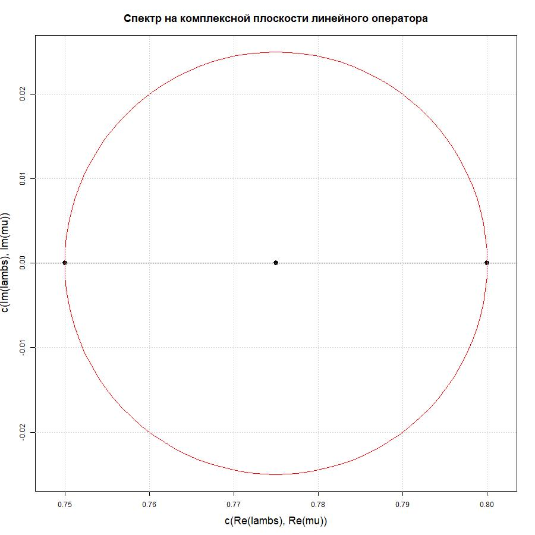

```{r}
suppressPackageStartupMessages(library(IMSSLAE))
```

***

# Проверка функции muFind()
```{r}

```

Функция **muFind()** осуществляет поиск центра круга для выпуклой оболочки спектра линейного оператора, а также производит отрисовку комплексной плоскости вместе с найденной фигурой.  

Случай случайного задания спектра:

```{r}
# Зададимся случайным распределением точек спектра
lambs <- rnorm(15, 15, 4) + 1i * rnorm(15, 15, 4)
# Выведем значения собственных числел
cat(lambs,"\n")
# Найдем итерационный параметр

print(IMSSLAE::muFind(lambs = lambs, draw = T))
```



Случай наличия всего спектра на отрезке действительной оси:

```{r}
lambs <- rnorm(50, 100, 10)
print(IMSSLAE::muFind(lambs))
```

```{r}
lambs <- c(5+5i, 5.12+5.12i, 6.4+6.4i, 6.5+6.5i, 7.4+7.4i, 10 + 10i)
muFind(lambs)
```

```{r}
lambs <- c(3+2i, 4 + 8i)
muFind(lambs)
```

```{r}
lambs <- c(5 + 5i, 10 + 5i, 7.5 + 10i)
muFind(lambs)
```


***

# Численный эксперимент для конкретных задач решения СЛАУ

Рассмотрим задачу, с заданными оператором A, вектором свободных членов f, начальным приближением u. Будем также считать, что все собственные значения спектра оператора нам известны, а в программе воспользуемся базовой функцией для ее определения в пользу демострации работы алгоритмов.
```{r}
library(ggplot2)
n <- 100
A <- diag(rnorm(n, 0.5, 0.04), nrow = 100, ncol = 100)
f <- rnorm(n, 1, 1)
u <- rnorm(n, 1, 1)

resultGMSI <- GMSI.mu.history(A, f, u, lambs = diag(A), eps = 10e-6)
resultSIM <- SIM.history(A, f, u, eps = 10e-6)
resultGDM <- GDM.history(A, f, u, eps= 10e-6)
resultIMRES <- IMRES.history(A, f, u, eps = 10e-6)
resultChebishev <- Chebishev.history(A, u, f, lambs = diag(A), layers = 20L, eps = 10e-6)

max(abs(resultGMSI$var - f/diag(A)))
max(abs(resultSIM$var - f/diag(A)))
max(abs(resultGDM$var - f/diag(A)))
max(abs(resultIMRES$var - f/diag(A)))
max(abs(resultChebishev$var - f/diag(A)))

Re(sqrt(t(A %*% resultGMSI$var - f) %*% (A %*% resultGMSI$var - f))/sqrt(t(f) %*% f))
Re(sqrt(t(A %*% resultSIM$var - f) %*% (A %*% resultSIM$var - f))/sqrt(t(f) %*% f))
Re(sqrt(t(A %*% resultGDM$var - f) %*% (A %*% resultGDM$var - f))/sqrt(t(f) %*% f))
Re(sqrt(t(A %*% resultIMRES$var - f) %*% (A %*% resultIMRES$var - f))/sqrt(t(f) %*% f))
Re(sqrt(t(A %*% resultChebishev$var - f) %*% (A %*% resultChebishev$var - f))/sqrt(t(f) %*% f))

  ggplot()+
    geom_line(aes(x = 0:(resultGMSI$num.iter), y = sqrt(apply(Re(resultGMSI$var.hist^2), 2, sum))),  color = "red") +
    geom_line(aes(x = 0:(resultSIM$num.iter), y = sqrt(apply(Re(resultSIM$var.hist^2), 2, sum))), color = "black") +
    geom_line(aes(x = seq(0,(resultGDM$num.iter),10), y = sqrt(apply(Re(resultGDM$var.hist^2), 2, sum))),  color = "purple") +
    geom_line(aes(x = 0:(resultIMRES$num.iter), y = sqrt(apply(Re(resultIMRES$var.hist^2), 2, sum))), color = "forestgreen") +
    geom_line(aes(x = 0:(resultChebishev$num.iter), y = sqrt(apply(Re(resultChebishev$var.hist^2), 2, sum))), color = "blue") +
    theme_bw() +
    labs(title = "Сходимость нормы вектора к истинному значению", x = "Число итераций", y = "Норма неизвестного вектора по шагам итераций") +
    coord_cartesian(xlim = c(0, 30)) +
    scale_x_continuous(breaks = seq(0, 30, 2)) +
    geom_hline(yintercept = sqrt(t(f/diag(A)) %*% (f/diag(A))), lty = 3, lwd = 1.2, color = "gold")
```

```{r}
library(ggplot2)
n <- 1000
A <- diag(rnorm(n, 500, 75), nrow = n, ncol = n)
f <- rnorm(n, 100, 200)
u <- rnorm(n, 500, 5)

resultGMSI <- GMSI.history(A, f, u, mu = 500, eps = 10e-6)
resultGDM <- GDM.history(A, f, u, eps = 10e-6)
resultIMRES <- IMRES.history(A, f, u, eps = 10e-6)

max(abs(resultGMSI$var - f/diag(A)))
max(abs(resultGDM$var - f/diag(A)))
max(abs(resultIMRES$var - f/diag(A)))

Re(sqrt(t(A %*% resultGMSI$var - f) %*% (A %*% resultGMSI$var - f))/sqrt(t(f) %*% f))
Re(sqrt(t(A %*% resultGDM$var - f) %*% (A %*% resultGDM$var - f))/sqrt(t(f) %*% f))
Re(sqrt(t(A %*% resultIMRES$var - f) %*% (A %*% resultIMRES$var - f))/sqrt(t(f) %*% f))

  ggplot()+
    geom_line(aes(x = 0:(resultGMSI$num.iter), y = sqrt(apply(Re(resultGMSI$var.hist^2), 2, sum))),  color = "red") +
    geom_line(aes(x = seq(0,(resultGDM$num.iter),10), y = sqrt(apply(Re(resultGDM$var.hist^2), 2, sum))),  color = "purple") +
    geom_line(aes(x = 0:(resultIMRES$num.iter), y = sqrt(apply(Re(resultIMRES$var.hist^2), 2, sum))), color = "forestgreen") +
    theme_bw() +
    labs(title = "Сходимость нормы вектора к истинному значению", x = "Число итераций", y = "Норма неизвестного вектора по шагам итераций") +
    coord_cartesian(xlim = c(0, 30)) +
    scale_x_continuous(breaks = seq(0, 30, 2)) +
    geom_hline(yintercept = sqrt(t(f/diag(A)) %*% (f/diag(A))), lty = 3, lwd = 1.2, color = "gold")
```

```{r}
library(ggplot2)
n <- 5000
A <- diag(rnorm(n, 300, 20), nrow = n, ncol = n)
f <- rnorm(n, 1, 200)
u <- rnorm(n, 1000, 300)

resultGMSI <- GMSI.history(A, f, u, mu = 300, eps = 10e-6)
#resultGDM <- GDM.history(A, f, u, eps = 10e-6)
resultIMRES <- IMRES.history(A, f, u, eps = 10e-6)
resultChebishev <- Chebishev.history(A, u, f, lambs = diag(A), layers = 1L, eps = 10e-6)

max(abs(resultGMSI$var - f/diag(A)))
#max(abs(resultGDM$var - f/diag(A)))
max(abs(resultIMRES$var - f/diag(A)))
max(abs(resultChebishev$var - f/diag(A)))

Re(sqrt(t(A %*% resultGMSI$var - f) %*% (A %*% resultGMSI$var - f))/sqrt(t(f) %*% f))
#Re(sqrt(t(A %*% resultGDM$var - f) %*% (A %*% resultGDM$var - f))/sqrt(t(f) %*% f))
Re(sqrt(t(A %*% resultIMRES$var - f) %*% (A %*% resultIMRES$var - f))/sqrt(t(f) %*% f))
Re(sqrt(t(A %*% resultChebishev$var - f) %*% (A %*% resultChebishev$var - f))/sqrt(t(f) %*% f))

  ggplot()+
    geom_line(aes(x = 0:(resultGMSI$num.iter), y = sqrt(apply(Re(resultGMSI$var.hist^2), 2, sum))),  color = "red") +
    #geom_line(aes(x = seq(0,(resultGDM$num.iter),10), y = sqrt(apply(Re(resultGDM$var.hist^2), 2, sum))),  color = "purple") #+
    geom_line(aes(x = 0:(resultIMRES$num.iter), y = sqrt(apply(Re(resultIMRES$var.hist^2), 2, sum))), color = "forestgreen") +
    geom_line(aes(x = 0:(resultChebishev$num.iter), y = sqrt(apply(Re(resultChebishev$var.hist^2), 2, sum))), color = "blue") +
    theme_bw() +
    labs(title = "Сходимость нормы вектора к истинному значению", x = "Число итераций", y = "Норма неизвестного вектора по шагам итераций") +
    coord_cartesian(xlim = c(0, 10)) +
    scale_x_continuous(breaks = seq(0, 10, 2)) +
    geom_hline(yintercept = sqrt(t(f/diag(A)) %*% (f/diag(A))), lty = 3, lwd = 1.2, color = "gold")
```

```{r}
# Зададимся начальными условиями
A <- cbind(c(3, 4, 0.2),
            c(-4, 8, 0.1),
            c(2.9, -3, 1))
u <- c(1, 0.5, 1.7)
f <- c(1.8, 9.1, 1.3)
lambs <- eigen(A)$values
mu <- muFind(lambs = lambs, draw = T)[1]
cat("Матрица A:\n")
print(A)
cat("\nВектор u равен: u =( ", u, ")\nВектор f равен: f =( ", f, ")\nВектор lambs равен: l =( ", lambs,")\n")
```

На данных начальных условиях рассмотрим задачу поиска неивестного вектора u итерационными методами

```{r}
resultGMSI <- GMSI.history(A, f, u, mu, eps = 10e-5)
resultJacobi <- Jacobi.history(A, f, u, eps = 10e-5)
resultGDM <- GDM.history(A, f, u, eps = 10e-5)
resultIMRES <- IMRES.history(A, f, u, eps = 10e-5)

ggplot2::ggplot() +
  geom_line(aes(x = 0:(resultGMSI$num.iter), y = sqrt(apply(Re(resultGMSI$var.hist^2), 2, sum))),  color = "red") +
  geom_line(aes(x = seq(0,(resultGDM$num.iter),10)/10, y = sqrt(apply(Re(resultGDM$var.hist^2), 2, sum))), color = "black") +
  geom_line(aes(x = 0:(resultIMRES$num.iter), y = sqrt(apply(Re(resultIMRES$var.hist^2), 2, sum))), color = "blue") +
  theme_bw() +
  labs(title = "Сходимость нормы вектора к истинному значению", x = "Число итераций", y = "Норма неизвестного вектора по шагам итераций")+
    geom_hline(yintercept = sqrt(t(solve(A) %*% f) %*% (solve(A) %*% f)), lty = 3, lwd = 1.2, color = "gold")


ggplot2::ggplot() +
  geom_line(aes(x = 0:(resultGMSI$num.iter), y = sqrt(apply(Re(resultGMSI$var.hist^2), 2, sum))),  color = "red") +
  geom_line(aes(x = seq(0,(resultGDM$num.iter),10)/10, y = sqrt(apply(Re(resultGDM$var.hist^2), 2, sum))), color = "black") +
  geom_line(aes(x = 0:(resultIMRES$num.iter), y = sqrt(apply(Re(resultIMRES$var.hist^2), 2, sum))), color = "blue") +
  theme_bw() +
  labs(title = "Сходимость нормы вектора к истинному значению", x = "Число итераций", y = "Норма неизвестного вектора по шагам итераций")+
  coord_cartesian(xlim = c(0, 55))+
  scale_x_continuous(breaks = seq(0, 55, 5)) +
    geom_hline(yintercept = sqrt(t(solve(A) %*% f) %*% (solve(A) %*% f)), lty = 3, lwd = 1.2, color = "gold")


Re(sqrt(t(A %*% resultGMSI$var - f) %*% (A %*% resultGMSI$var - f))/sqrt(t(f) %*% f))
#Re(sqrt(t(A %*% resultGDM$var - f) %*% (A %*% resultGDM$var - f))/sqrt(t(f) %*% f))
Re(sqrt(t(A %*% resultIMRES$var - f) %*% (A %*% resultIMRES$var - f))/sqrt(t(f) %*% f))
Re(sqrt(t(A %*% resultGDM$var - f) %*% (A %*% resultGDM$var - f))/sqrt(t(f) %*% f))

print(paste(resultGMSI$systime.iter, resultJacobi$systime.iter))
```

```{r}
# Зададимся начальными условиями
A <- cbind(c(0.75, 0), c(-1, 0.8))
f <- c(1, 1)
u <- c(4.4, 1.57)
lambs <- eigen(A)$values
mu <- muFind(lambs = lambs, draw = T)[1]
cat("Матрица A:\n")
print(A)
cat("\nВектор u равен: u =( ", u, ")\nВектор f равен: f =( ", f, ")\nВектор lambs равен: l =( ", lambs,")\n")
```

```{r}
resultGMSI <- GMSI.history(A, f, u, mu, eps = 10e-5)
resultGDM <- GDM.history(A, f, u, eps = 10e-5)
resultSIM <- SIM.history(A, f, u, eps = 10e-5)
resultIMRES <- IMRES.history(A, f, u, eps = 10e-5)

ggplot2::ggplot() +
  geom_line(aes(x = 0:(resultGMSI$num.iter), y = sqrt(apply(Re(resultGMSI$var.hist^2), 2, sum))),  color = "red") +
  geom_line(aes(x = seq(0,(resultGDM$num.iter), 10) /10, y = sqrt(apply(Re(resultGDM$var.hist^2), 2, sum))), color = "black") +
  geom_line(aes(x = 0:(resultSIM$num.iter), y = sqrt(apply(Re(resultSIM$var.hist^2), 2, sum))), color = "purple") +
  geom_line(aes(x = 0:(resultIMRES$num.iter), y = sqrt(apply(Re(resultIMRES$var.hist^2), 2, sum))), color = "green") +
  theme_bw() +
  labs(title = "Сходимость нормы вектора к истинному значению", x = "Число итераций", y = "Норма неизвестного вектора по шагам итераций")

Re(sqrt(t(A %*% resultGMSI$var - f) %*% (A %*% resultGMSI$var - f))/sqrt(t(f) %*% f))
#Re(sqrt(t(A %*% resultGDM$var - f) %*% (A %*% resultGDM$var - f))/sqrt(t(f) %*% f))
Re(sqrt(t(A %*% resultSIM$var - f) %*% (A %*% resultSIM$var - f))/sqrt(t(f) %*% f))
Re(sqrt(t(A %*% resultGDM$var - f) %*% (A %*% resultGDM$var - f))/sqrt(t(f) %*% f))
Re(sqrt(t(A %*% resultIMRES$var - f) %*% (A %*% resultIMRES$var - f))/sqrt(t(f) %*% f))
```

```{r}
n <- 50
A <- diag(rnorm(n, 2, 0.05), nrow = n, ncol = n)
f <- rnorm(n, 2, 0.05)
u <- rep(1, n)

resultGMSI <- GMSI.mu.history(A, f, u, lambs = diag(A), eps = 10e-5)
resultJacobi <- Jacobi.history(A, f, u, eps = 10e-5)
#resultSIM <- SIM.history(A, f, u, eps = 10e-5)
ggplot2::ggplot() +
  geom_line(aes(x = 0:(resultGMSI$num.iter), y = sqrt(apply(Re(resultGMSI$var.hist^2), 2, sum))),  color = "red") +
  geom_line(aes(x = 0:(resultJacobi$num.iter), y = sqrt(apply(Re(resultJacobi$var.hist^2), 2, sum))), color = "black") +
  theme_bw() +
  labs(title = "Сходимость нормы вектора к истинному значению", x = "Число итераций", y = "Норма неизвестного вектора по шагам итераций")

print(paste(resultGMSI$systime.iter, resultJacobi$systime.iter))
```
